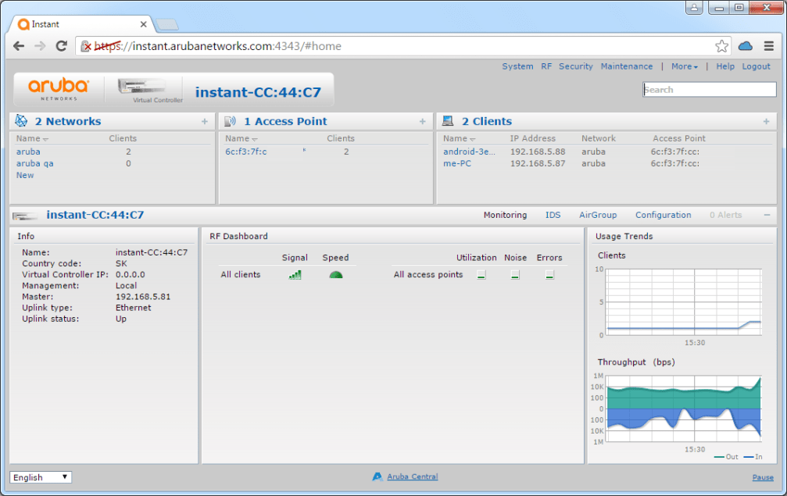
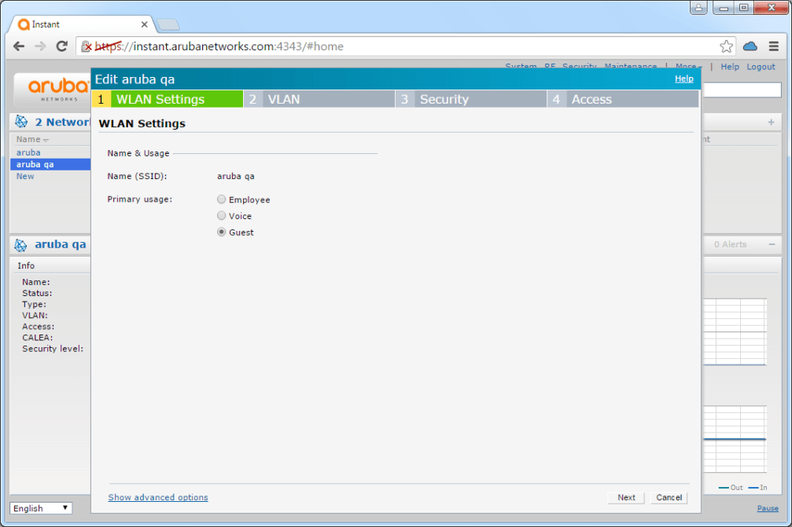
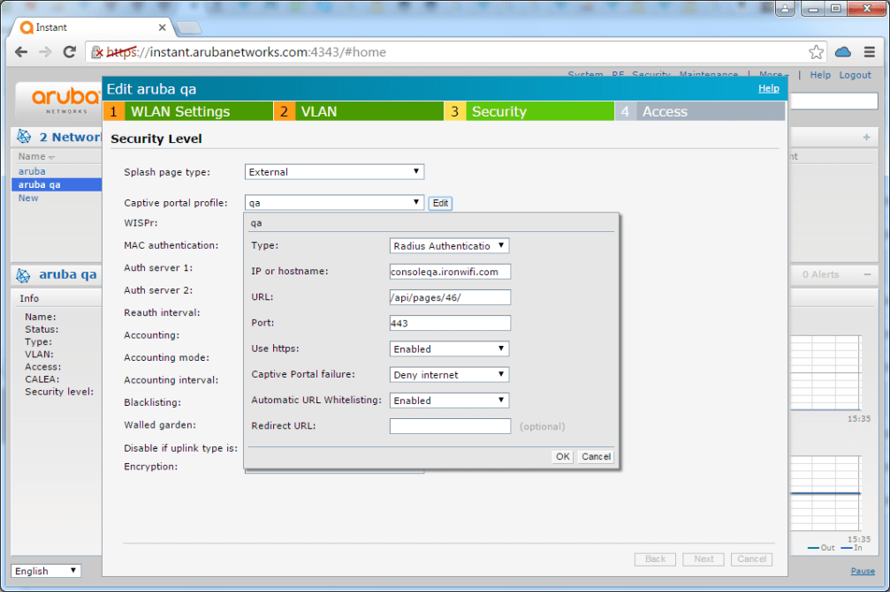
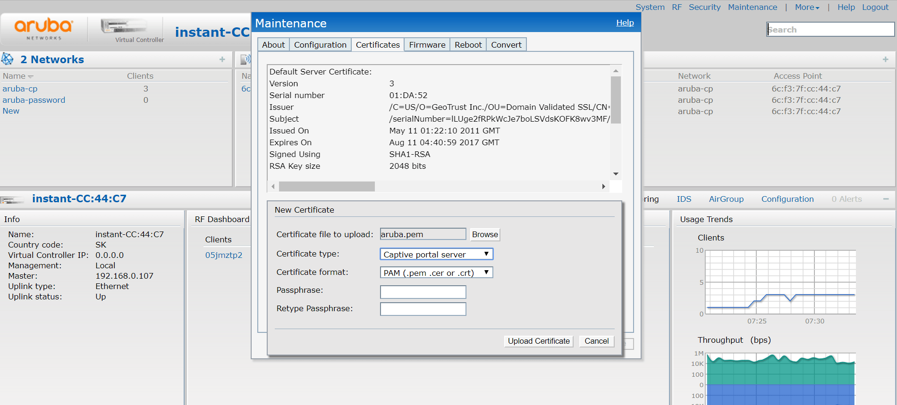

This page explains basic configuration for Aruba Virtual Controller and external Captive Portal with RADIUS authentication.

Sign-in to the Aruba Administration console usually available at [https://instant.arubanetworks.com:4343](https://instant.arubanetworks.com:4343).

Navigate to Network -> Edit and open configuration settings of a network that should be protected with a Captive Portal with RADIUS authentication - Aruba qa in our example.

Configure the Client IP & VLAN Assignment. In our example, we keep the default settings.

Navigate to the Security tab and configure Security Level:

Splash page type: External

Captive portal profile: QA in our example

Auth server 1: QA in our case

Accounting: Use authentication servers

Encryption: Disabled

Click on the Edit button next to the Captive portal profile. Find the Splash page URL in the IronWifi Console -> Captive Portal settings page, for example, https://europe-west1.ironwifi.com/api/pages/r-3wcpj-eezn3-b32pa/

Type: Radius Authentication

IP or hostname: europe-west1.ironwifi.com

(extract hostname from the Splash page URL)

URL: /api/pages/r-3wcpj-eezn3-b47pa/

(URL from the Splash page URL)

Port: 443

Use https: Enabled

Captive Portal failure: Deny internet

Automatic URL Whitelisting: Enabled

Redirect URL: empty

Click on the Edit button next to the Auth server. Find the RADIUS server information in the IronWifi Console, for example, IP 81.89.56.92, Authentication port 5701, Accounting port 5702.

IP address: 81.89.**.**

(assigned RADIUS server IP address)

Auth port: 570*

(designated RADIUS server authentication port)

Accounting port: 570*

(assigned RADIUS server accounting port)

Shared key: ***********

(assigned RADIUS server secret)

Click on the Walled garden link and enter values from the IronWifi console:

White list: all IP addresses and host-names from the IronWifi console

By default, the Aruba controller will intercept HTTPS traffic to all external servers breaking SSL connections. To prevent this, we need to create a new Role permitting TCP connections to port 443 on external servers - splash.ironwifi.com, europe-west2.ironwifi.com, google.com, facebook.com, etc.

Enable the Assign pre-authentication role and select create a role. Click on the Finish button to apply new settings.

pre-authentication

To fix the SSL error, you will need to replace the default invalid certificate.

You can generate a valid SSL certificate for free on this URL - https://www.sslforfree.com/. You can let the page create a certificate signing request for you, or visit the following page for detailed instructions on how to generate a request manually - (https://community.arubanetworks.com/t5/Controller-less-WLANs/How-to-Create-a-Certificate-for-Instant-Captive-Portal-using/ta-p/277025). Don't use a wildcard SSL certificate.

Copy content of downloaded files certificate.crt, ca_bundle.crt, and private.key to a single file (aruba.pem).

Upload this file to your Aruba IAP - click on Maintenance -> Certificates.

Certificate type: Captive portal server certificate

Certificate format: PAM

Click on the Upload Certificate button to apply new settings.
