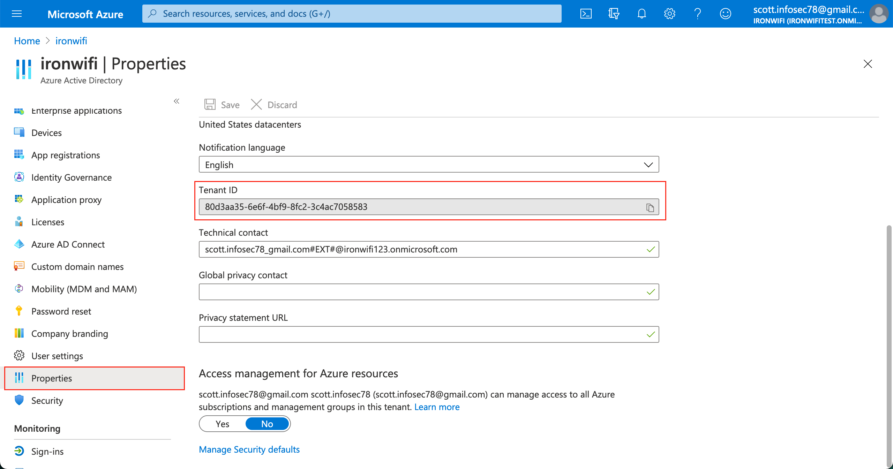
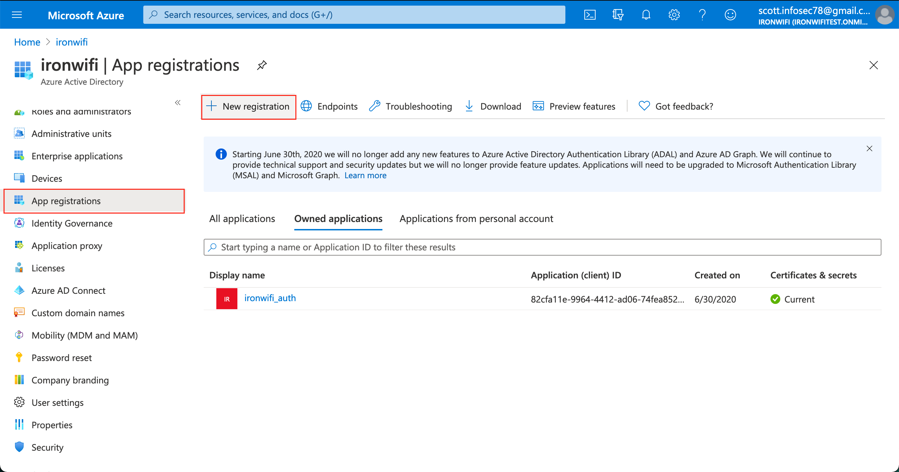
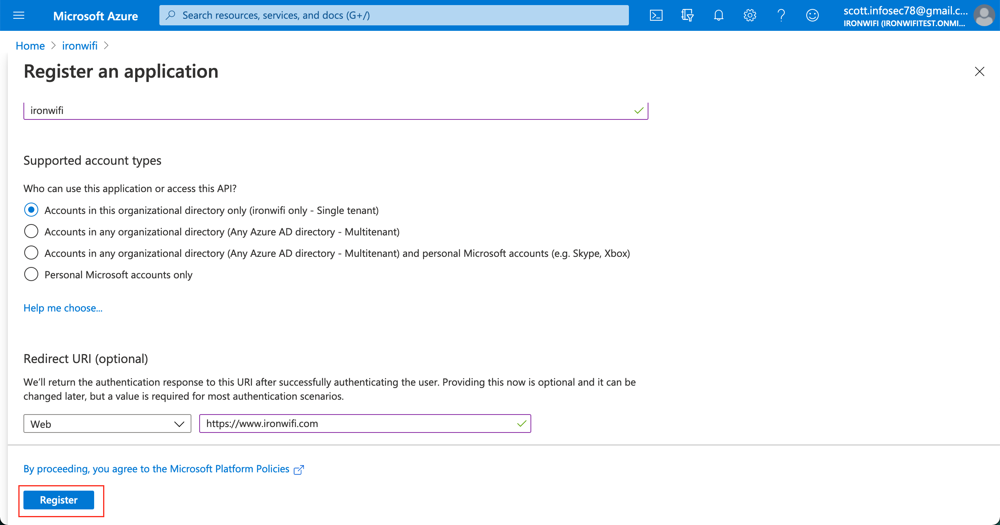
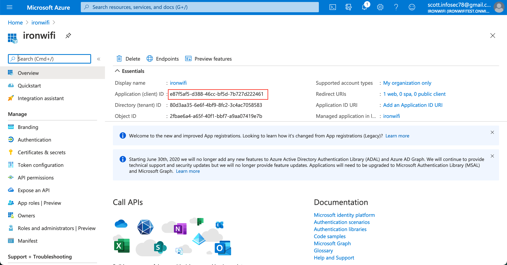
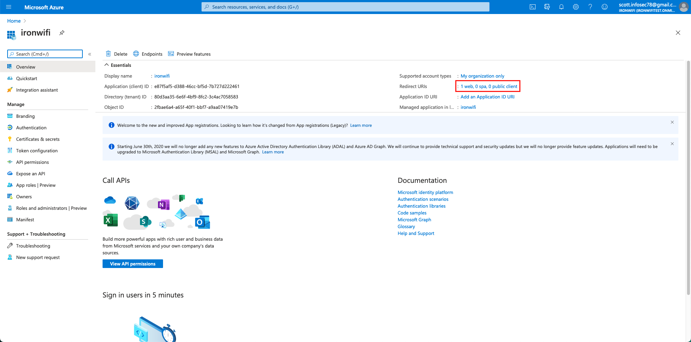
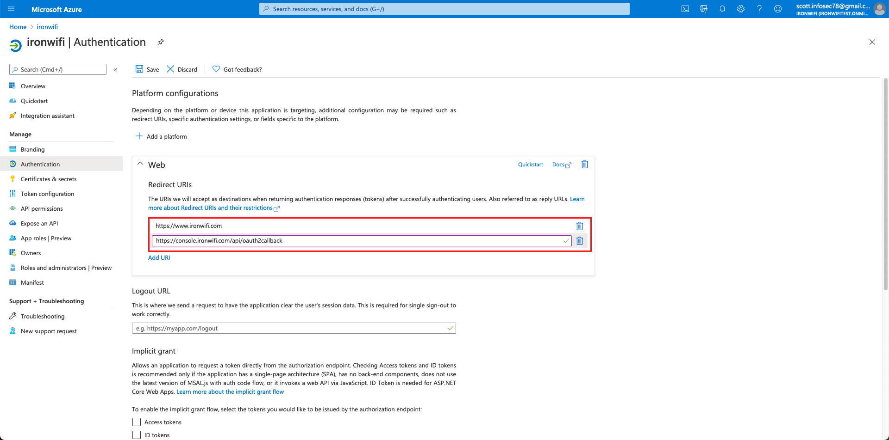
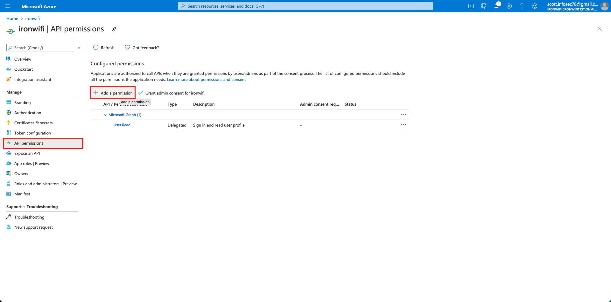
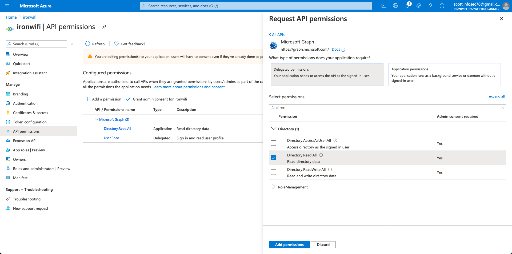
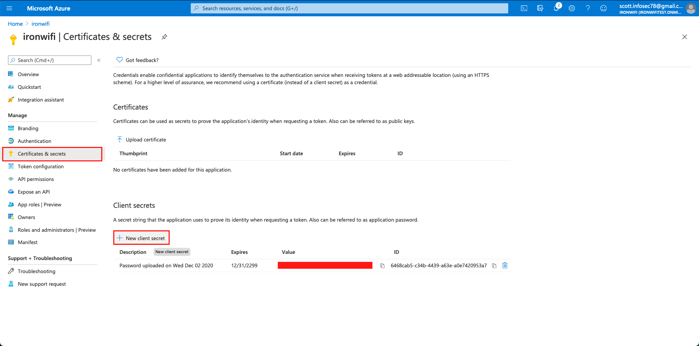
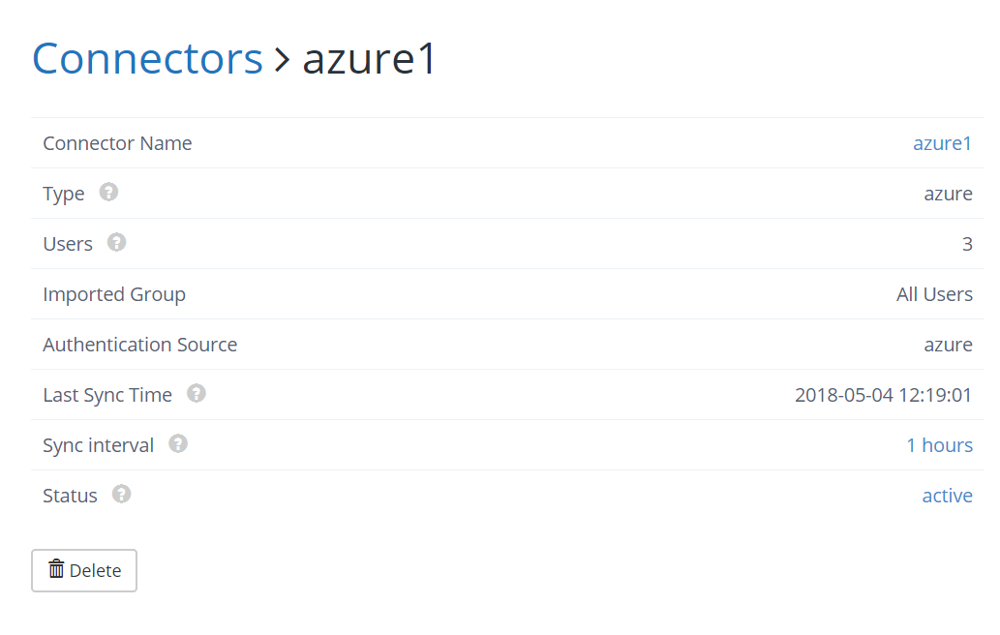

# Azure Active Directory

To manage your wireless users using Azure Active Directory account, you can enable remote synchronization with your Azure account for users in specific groups.

**In your Azure Active Directory portal**

1. [Log in to the Azure portal](https://portal.azure.com)
2. From the main menu, navigate to **Azure Active Directory > Properties > Directory ID**. Copy the Directory ID value. It is your Tenant ID.
3. From the menu, go to **Azure Active Directory -> App registrations**
4. Click on **New application registration**
        1. Name - _ironwifi_ for example
        2. Application type - _Web app / API_
        3. Sign-on URL - https://www.ironwifi.com
5. Copy the Application ID value.
6. Click on the Settings button.
7. Click on Reply URLs and add **https://console.ironwifi.com/api/oauth2callback**. If you are using some other region, replace console with the territory, e.g., _us-west1.ironwifi.com_
8. Click on Required permissions and click _Add_
        1. API - Microsoft Graph
        2. Application Permissions and Delegated Permissions - Read directory data
9. Click on Keys and add a key - duration _Never expires_. Copy the generated value.

**In the IronWifi Console**

1. [Log in to the IronWifi Console](https://console.ironwifi.com/)
2. From the menu, go to **Users -> Connectors -> New Connector**
3. Fill in Name, select **_Azure AD_** as **Database Type**
4. Select Authentication Source:
        1. **_Azure_** - will forward authentication requests to Microsoft servers for verification
        2. **_Local_** will verify provided credentials locally - Cleartext-Password attribute, etc.
5. Enter the Tenant identifier value (Directory ID)
6. Enter the Application ID and Application Key.
7. Click the Continue button, and you will receive a unique authorization code.
8. Click to Authorize, and we will redirect you to the Azure portal for authorization. Approve the request.
9. Click Continue
10. In the **Select Group for Import** window, select the **_Group_** that you want to import

Every imported user will have a random password generated. Please do not delete these generated passwords. They can be used for authentication if there is some problem with your Azure account. Deleting the generated password will disable the user's ability to authenticate.

 

**11. Authentication**

You have multiple options on how to authenticate your imported users:

**_Option 1: Authentication using the generated password - PEAP_**

During the initial synchronization, we create a random password for every imported user. Use **CSV export** function to export the list of passwords and provide these passwords to your users. You can also change the generated password manually or use our API.

**_Option 2: Authentication using certificate - TLS_**

You can manually create a client certificate for each user and distribute these certificates to your users. Users will be able to authenticate to your network using these certificate.

**_Option 3: Authentication using existing Azure account password - TTLS + PAP_**

If your users wish to authenticate using their existing Azure credentials, configure your clients to use the TTLS-PAP protocol.

**_Option 4: Authentication using existing Azure account password - PEAP-MSCHAPv2_**

If your users wish to authenticate using their existing Azure credentials and you have AD Domain Services enabled, create an [Azure AD Bridge](https://www.ironwifi.com/azure-ad-authentication-peap-mschapv2/).

 

**12. Configuring Client Devices**

a. The easiest method is to use our [profile generator tool](https://www.ironwifi.com/wifi-profile-generator/) since as you will see from the below instructions that Windows makes this setup a very cumbersome task

b. If you prefer to do it manually Follow system specific instructions on how to configure your clients:

- [Windows Clients](https://www.ironwifi.com/windows-clients/)
- [Android Clients](https://www.ironwifi.com/android-clients/)
- [Apple iOS, Mac OS X Clients](https://www.ironwifi.com/ios-mac-os-clients/)

